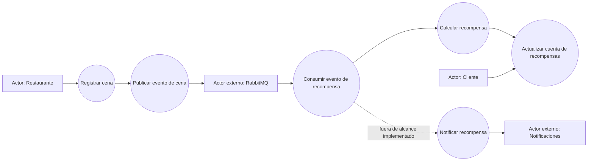

# Arquitectura implementada — Rewards

La solución implementa el proceso de recompensas con **Clean Architecture / Arquitectura Hexagonal** y un flujo orientado a eventos. El objetivo es mantener alta cohesión dentro de cada capa y bajo acoplamiento entre API, dominio, persistencia y mensajería.

## Casos de uso



| Actor | Caso de uso | Resultado |
|-------|-------------|-----------|
| Restaurante | Registrar cena | Se valida la transacción y se publica un evento. |
| Broker RabbitMQ | Entregar mensaje | Desacopla productor y consumidor mediante exchange/queue. |
| Sistema de recompensas | Procesar recompensa | Calcula puntos/cashback y persiste el resultado. |
| Sistema de notificaciones | Notificar recompensa | Queda fuera del alcance implementado; el diseño permite agregarlo como evento posterior. |

## Patrón arquitectónico

```text
interfaces/        API FastAPI y worker CLI
      ↓
application/       casos de uso y puertos
      ↓
domain/            modelos y reglas de recompensa
      ↑
infrastructure/    SQLAlchemy y RabbitMQ implementan puertos
```

## Decisiones de diseño

| Requisito del PDF | Cumplimiento |
|-------------------|--------------|
| Modularidad, abstracción, bajo acoplamiento y alta cohesión | Separación `domain`, `application`, `infrastructure`, `interfaces`, `config`. |
| Arquitectura adecuada | Clean/Hexagonal + Event-Driven Architecture. |
| Mensajería | RabbitMQ con exchange `rewards.events`, queue `rewards.processing` y contrato `reward.action.registered` v1. |
| Procesamiento de cena | `POST /reward-actions` registra la cena y publica el evento. |
| Consumidor de recompensas | Worker consume el evento y ejecuta el caso de uso `ProcessRewardEvent`. |
| Calidad | Tests automatizados, cobertura mayor al 85% y configuración Sonar. |

## Flujo principal

1. El restaurante llama `POST /reward-actions` con monto, tarjeta, restaurante y fecha.
2. La API valida la entrada, persiste la acción e invoca el puerto publicador. En runtime real se configura `REWARD_EVENT_PUBLISHER=rabbitmq`; los tests pueden inyectar un publicador en memoria sin depender de un broker.
3. RabbitMQ entrega el evento al worker consumidor.
4. El worker deserializa el contrato y ejecuta el cálculo de recompensa.
5. La recompensa queda persistida de forma idempotente.

## Evidencia de calidad

- Comando de pruebas: `python -m pytest`
- Comando de cobertura: `coverage run -m pytest && coverage xml -o coverage.xml`
- Comando Sonar: `sonar-scanner`
- Cobertura verificada durante implementación: 92%.
